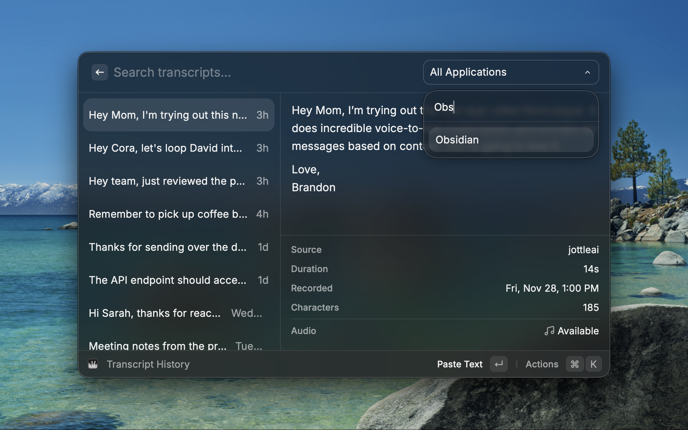
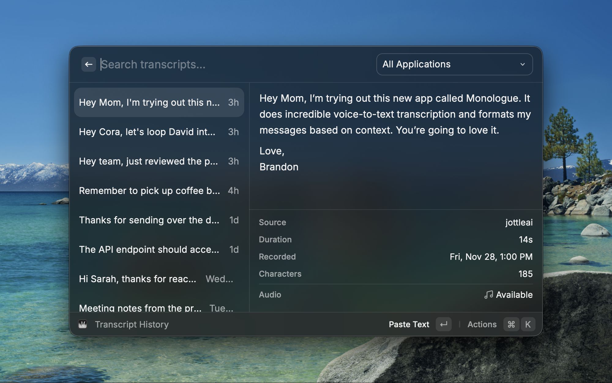

# Monologue

Quick access to your [Monologue](https://www.monologue.to/) voice transcripts.

## Commands

- **Transcript History** - Browse and search all transcripts with a detail panel showing source app, duration, and recording time. Filter by application.
- **Paste Last Transcript** - Instantly paste your most recent transcript
- **Paste Last Raw Transcript** - Paste the unprocessed text (before AI cleanup)
- **Copy Last Transcript** - Copy your most recent transcript to clipboard

## Local Installation

To install the extension locally before it's available on the Raycast Store:

1. Clone this repository
2. Install dependencies: `npm install`
3. Build the extension: `npm run build`
4. Open Raycast and run "Import Extension"
5. Select the cloned folder

Alternatively, run `npm run dev` to start development mode, which automatically imports the extension into Raycast.

## Requirements

Requires [Monologue](https://www.monologue.to/) to be installed on your Mac.